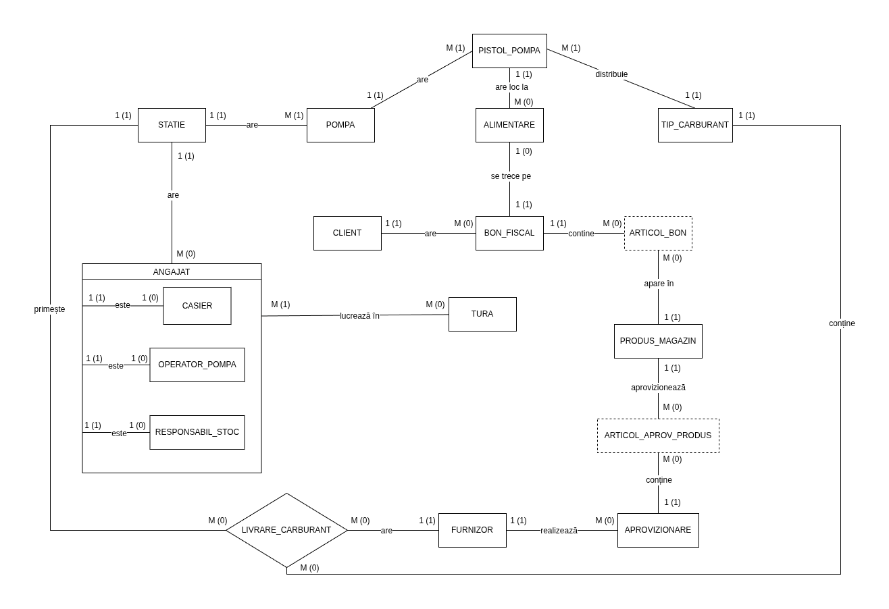

# Stație de alimentare cu carburant

Proiect pentru cursul de **Baze de date**, realizat de **Matei Calomfirescu**, **grupa 211**.

## 1. Descrierea modelului real, a utilității acestuia și a regulilor de funcționare

Modelul real ales pentru acest proiect este o stație de alimentare cu carburanți, adică o benzinărie care 
desfășoară atât activități comerciale cu clienții, cât și activități interne de administrare și 
aprovizionare. O astfel de unitate va gestiona vânzarea de carburant, comercializarea produselor din magazin,
emiterea bonurilor fiscale, evidența angajaților și a turelor de lucru, precum și relațiile cu furnizorii.

Această bază de date are rolul de a modela organizat toate aceste activități, astfel încât informațiile 
importante să poată fi stocate, actualizate și interogate ușor. Prin intermediul acestei baze de date se 
pot urmări elemente esențiale din funcționarea stației, cum ar fi: ce tipuri de carburant sunt disponibile, 
la ce pompe se realizează alimentările, prin ce pistol de pompă se face o alimentare, ce produse se vând în
magazin, ce bonuri fiscale au fost emise, ce angajați lucrează în anumite ture, ce aprovizionări de produse
au fost făcute de la furnizori și ce livrări de carburant au fost primite de stație.

Utilitatea modelului este una practică și clară. În primul rând, acesta permite organizarea activității 
comerciale a stației, prin evidența alimentărilor și a vânzărilor de produse. În al doilea rând, permite 
gestionarea activității interne, prin evidența angajaților, a rolurilor acestora și a turelor de lucru. În 
plus, baza de date oferă suport pentru urmărirea stocurilor și a aprovizionărilor, ceea ce este esențial 
pentru buna funcționare a magazinului și a întregii stații.

Baza de date urmărește două fluxuri de activitate:

1) **Activitatea comercială**

Un client vine în stație pentru a alimenta cu carburant la una dintre pompe și, opțional, poate cumpăra și 
produse din magazin. Fiecare pompă poate avea unul sau mai multe pistoale, iar fiecare pistol de pompă este 
asociat unui anumit tip de carburant. La finalul tranzacției, se emite un bon fiscal care centralizează 
produsele cumpărate și, după caz, alimentarea efectuată. Astfel, baza de date va trebui să poată reține 
informații despre client, pompă, pistolul folosit, tipul de carburant, bonul fiscal și articolele înscrise pe bon.

2) **Activitatea internă**
   
Stația funcționează cu ajutorul angajaților, care lucrează în ture și au responsabilități diferite. Entitatea 
ANGAJAT este tratată ca superentitate, având ca subentități CASIER, OPERATOR_POMPA și RESPONSABIL_STOC. 
Astfel, modelul surprinde faptul că nu toți angajații au aceleași atribuții. Tot în activitatea internă intră 
și aprovizionarea stației de la diverși furnizori, pentru produsele din magazin, precum și livrările de 
carburant asociate stației, furnizorului și tipului de carburant.

Entitățile bazei de date:
1. [STAȚIE](#entitatea-stație) - Reține informațiile despre benzinărie;
2. [TIP_CARBURANT](#entitatea-tip-carburant) - Tipruile de carburant vândute;
3. [POMPA](#entitatea-pompa) - Pompele de alimentare;
4. [PISTOL_POMPA](#entitatea-pistol-pompa) - Pistoalele asociate pompelor, fiecare corespunzând unui tip de carburant;
5. [CLIENT](#entitatea-client) - Clienții care alimentează și cumpără produse;
6. [ANGAJAT](#entitatea-angajat) - Superentitate pentru toți angajații stației;
7. [CASIER](#entitatea-casier) - Subentitate pentru angajații care lucrează la casă;
8. [OPERATOR_POMPA](#entitatea-operator-pompa) - Subentitate pentru angajații care operează pompele;
9. [RESPONSABIL_STOC](#entitatea-responsabil-stoc) - Subentitate pentru angajații care gestionează stocul magazinului;
10. [TURĂ](#entitatea-tura) - Reține informații despre turele de lucru ale angajaților;
11. [BON_FISCAL](#entitatea-bon-fiscal) - Reprezintă bonurile fiscale emise în urma tranzacțiilor;
12. [ALIMENTARE](#entitatea-alimentare) - Reprezintă operația de alimentare a unui client, realizată printr-un pistol de pompă și asociată unui bon fiscal;
13. [PRODUS_MAGAZIN](#entitatea-produs-magazin) - Produsele disponibile în magazin;
14. [ARTICOL_BON](#entitatea-articol-bon) - Tabel asociativ între BON_FISCAL și PRODUS_MAGAZIN pentru a înregistra produsele vândute în magazin;
15. [FURNIZOR](#entitatea-furnizor) - Furnizorii de carburant și produse;
16. [APROVIZIONARE](#entitatea-aprovizionare) - Reprezintă intrările de produse în stație de la furnizori;
17. [ARTICOL_APROV_PRODUS](#entitatea-articol-aprov-produs) - Tabel asociativ între APROVIZIONARE și PRODUS_MAGAZIN pentru a înregistra produsele aprovizionate;
18. [LIVRARE_CARBURANT](#entitatea-livrare-carburant) - Relație ternară între STAȚIE, FURNIZOR și TIP_CARBURANT, folosită pentru a înregistra livrările de carburant.

## 2. Prezentarea constrângerilor (restricții, reguli) impuse asupra modelului

O pompă aparține unei singure stații de alimentare.
-- cardinalități

Într-o stație de alimentare pot exista mai multe pompe.
-- cardinalități

Un pistol de pompă aparține unei singure pompe, iar o pompă poate avea mai multe pistoale.
-- cardinalități

Un pistol de pompă este asociat unui singur tip de carburant, iar un tip de carburant poate fi asociat mai multor pistoale.
-- cardinalități

Un client poate avea mai multe bonuri fiscale, dar un bon fiscal aparține unui singur client.
-- cardinalități

Un bon fiscal poate conține mai multe produse din magazin, iar un produs poate apărea pe mai multe bonuri fiscale.
-- cardinalități; relație de tip many-to-many, rezolvată prin ARTICOL_BON

O alimentare este realizată printr-un singur pistol de pompă și este asociată unui singur bon fiscal.
-- cardinalități

Un furnizor poate realiza mai multe aprovizionări, dar o aprovizionare provine de la un singur furnizor.
-- cardinalități

O aprovizionare poate conține mai multe produse din magazin, iar un produs poate apărea în mai multe aprovizionări.
-- cardinalități; relație de tip many-to-many, rezolvată prin ARTICOL_APROV_PRODUS

O livrare de carburant leagă un singur furnizor, o singură stație și un singur tip de carburant.
-- relație ternară

Un furnizor poate realiza mai multe livrări de carburant, o stație poate primi mai multe livrări de carburant, iar un tip de carburant poate apărea în mai multe livrări.
-- cardinalități

Un angajat poate lucra în mai multe ture, iar într-o tură pot lucra mai mulți angajați.
-- cardinalități

Un casier, un operator pompă sau un responsabil stoc trebuie să existe mai întâi ca angajat.
-- relația dintre superentitate și subentități

Numele angajatului, denumirea produsului, denumirea carburantului, data bonului fiscal și numărul pompei sunt cunoscute.
-- atribute NOT NULL

Prețul unui carburant și prețul unui produs din magazin trebuie să fie valori pozitive.
-- verificarea valorilor atributelor

Cantitatea alimentată trebuie să fie mai mare decât 0.
-- validarea datelor

Cantitatea unui produs trecută pe bon trebuie să fie mai mare decât 0.
-- validarea datelor

Stocul unui produs din magazin nu poate fi negativ.
-- reguli de consistență

Fiecare bon fiscal este identificat în mod unic.
-- cheia primară / unicitate

Fiecare alimentare trebuie asociată unui bon fiscal existent.
-- integritate referențială

## 6. Realizarea diagramei entitate-relație

