# Stație de alimentare cu carburant

Proiect pentru cursul de **Baze de date**, realizat de **Matei Calomfirescu**, **grupa 211**.

## 1. Descrierea modelului real, a utilității acestuia și a regulilor de funcționare

Modelul real ales pentru acest proiect este o stație de alimentare cu carburanți, adică o benzinărie care 
desfășoară atât activități comerciale cu clienții, cât și activități interne de administrare și 
aprovizionare. O astfel de unitate va gestiona vânzarea de carburant, comercializarea produselor din magazin,
emiterea bonurilor fiscale, evidența angajaților și a turelor de lucru, precum și relațiile cu furnizorii.

Această bază de date are rolul de a modela organizat toate aceste activități, astfel încât informațiile 
importante să poată fi stocate, actualizate și interogate ușor. Prin intermediul acestei baze de date se 
pot urmări elemente esențiale din funcționarea stației, cum ar fi: ce tipuri de carburant sunt disponibile, 
la ce pompe se realizează alimentările, prin ce pistol de pompă se face o alimentare, ce produse se vând în
magazin, ce bonuri fiscale au fost emise, ce angajați sunt programați în anumite ture, ce aprovizionări de 
produse au fost făcute de la furnizori și ce livrări de carburant au fost primite de stație.

Utilitatea modelului este una practică și clară. În primul rând, acesta permite organizarea activității 
comerciale a stației, prin evidența alimentărilor și a vânzărilor de produse. În al doilea rând, permite 
gestionarea activității interne, prin evidența angajaților, a rolurilor acestora și a turelor de lucru. În 
plus, baza de date oferă suport pentru urmărirea stocurilor și a aprovizionărilor, ceea ce este esențial 
pentru buna funcționare a magazinului și a întregii stații.

Baza de date urmărește două fluxuri de activitate:

1) **Activitatea comercială**

Un client vine în stație pentru a alimenta cu carburant la una dintre pompe și, opțional, poate cumpăra și 
produse din magazin. Fiecare pompă poate avea unul sau mai multe pistoale, iar fiecare pistol de pompă este 
asociat unui anumit tip de carburant. La finalul tranzacției, se emite un bon fiscal care centralizează 
produsele cumpărate și, după caz, alimentarea efectuată. Astfel, baza de date va trebui să poată reține 
informații despre client, pompă, pistolul folosit, tipul de carburant, bonul fiscal și articolele înscrise pe bon.

2) **Activitatea internă**
   
Stația funcționează cu ajutorul angajaților, care lucrează în ture și au responsabilități diferite. Entitatea 
ANGAJAT este tratată ca superentitate, având ca subentități CASIER, OPERATOR_POMPA și RESPONSABIL_STOC. 
Astfel, modelul surprinde faptul că nu toți angajații au aceleași atribuții. Relația dintre ANGAJAT și TURA
este gestionată prin entitatea asociativă PROGRAMARE_TURA. Tot în activitatea internă intră 
și aprovizionarea stației de la diverși furnizori, pentru produsele din magazin, precum și livrările de 
carburant asociate stației, furnizorului și tipului de carburant.

Entitățile bazei de date:
1. [STAȚIE](#entitatea-stație) - Reține informațiile despre benzinărie;
2. [TIP_CARBURANT](#entitatea-tip_carburant) - Tipurile de carburant vândute;
3. [POMPA](#entitatea-pompa) - Pompele de alimentare;
4. [PISTOL_POMPA](#entitatea-pistol_pompa) - Pistoalele asociate pompelor, fiecare corespunzând unui tip de carburant;
5. [CLIENT](#entitatea-client) - Clienții care alimentează și cumpără produse;
6. [ANGAJAT](#entitatea-angajat) - Superentitate pentru toți angajații stației;
7. [CASIER](#entitatea-casier) - Subentitate pentru angajații care lucrează la casă;
8. [OPERATOR_POMPA](#entitatea-operator_pompa) - Subentitate pentru angajații care operează pompele;
9. [RESPONSABIL_STOC](#entitatea-responsabil_stoc) - Subentitate pentru angajații care gestionează stocul magazinului;
10. [TURĂ](#entitatea-tura) - Reține informații despre turele de lucru ale angajaților;
11. [PROGRAMARE_TURA](#entitatea-programare_tura) - Tabel asociativ între ANGAJAT și TURA pentru evidența programărilor în ture;
12. [BON_FISCAL](#entitatea-bon_fiscal) - Reprezintă bonurile fiscale emise în urma tranzacțiilor;
13. [ALIMENTARE](#entitatea-alimentare) - Reprezintă operația de alimentare a unui client, realizată printr-un pistol de pompă și asociată unui bon fiscal;
14. [PRODUS_MAGAZIN](#entitatea-produs_magazin) - Produsele disponibile în magazin;
15. [ARTICOL_BON](#entitatea-articol_bon) - Tabel asociativ între BON_FISCAL și PRODUS_MAGAZIN pentru a înregistra produsele vândute în magazin;
16. [FURNIZOR](#entitatea-furnizor) - Furnizorii de carburant și produse;
17. [APROVIZIONARE](#entitatea-aprovizionare) - Reprezintă intrările de produse în stație de la furnizori;
18. [ARTICOL_APROV_PRODUS](#entitatea-articol_aprov_produs) - Tabel asociativ între APROVIZIONARE și PRODUS_MAGAZIN pentru a înregistra produsele aprovizionate;
19. [LIVRARE_CARBURANT](#entitatea-livrare_carburant) - Entitate asociativă provenită din relația ternară dintre STAȚIE, FURNIZOR și TIP_CARBURANT, folosită pentru a înregistra livrările de carburant.

## 2. Prezentarea constrângerilor (restricții, reguli) impuse asupra modelului

O pompă aparține unei singure stații de alimentare.
-- cardinalități

Într-o stație de alimentare pot exista mai multe pompe.
-- cardinalități

Un pistol de pompă aparține unei singure pompe, iar o pompă poate avea mai multe pistoale.
-- cardinalități

Un pistol de pompă este asociat unui singur tip de carburant, iar un tip de carburant poate fi asociat mai multor pistoale.
-- cardinalități

Un client poate avea mai multe bonuri fiscale, dar un bon fiscal aparține unui singur client.
-- cardinalități

Un bon fiscal poate conține mai multe produse din magazin, iar un produs poate apărea pe mai multe bonuri fiscale.
-- cardinalități; relație de tip many-to-many, rezolvată prin ARTICOL_BON

O alimentare este realizată printr-un singur pistol de pompă și este asociată unui singur bon fiscal.
-- cardinalități

Un bon fiscal poate avea cel mult o alimentare.
-- cardinalități

Un furnizor poate realiza mai multe aprovizionări, dar o aprovizionare provine de la un singur furnizor.
-- cardinalități

O aprovizionare poate conține mai multe produse din magazin, iar un produs poate apărea în mai multe aprovizionări.
-- cardinalități; relație de tip many-to-many, rezolvată prin ARTICOL_APROV_PRODUS

O livrare de carburant leagă un singur furnizor, o singură stație și un singur tip de carburant.
-- relație ternară

Un furnizor poate realiza mai multe livrări de carburant, o stație poate primi mai multe livrări de carburant, iar un tip de carburant poate apărea în mai multe livrări.
-- cardinalități

Un angajat poate lucra în mai multe ture, iar într-o tură pot lucra mai mulți angajați.
-- cardinalități; relație de tip many-to-many, rezolvată prin PROGRAMARE_TURA

Un casier, un operator pompă sau un responsabil stoc trebuie să existe mai întâi ca angajat.
-- relația dintre superentitate și subentități

Numele angajatului, denumirea produsului, denumirea carburantului, data bonului fiscal și numărul pompei sunt cunoscute.
-- atribute NOT NULL

Prețul unui carburant și prețul unui produs din magazin trebuie să fie valori pozitive.
-- verificarea valorilor atributelor

Cantitatea alimentată trebuie să fie mai mare decât 0.
-- validarea datelor

Cantitatea unui produs trecută pe bon trebuie să fie mai mare decât 0.
-- validarea datelor

Stocul unui produs din magazin nu poate fi negativ.
-- reguli de consistență

Fiecare bon fiscal este identificat în mod unic.
-- cheia primară / unicitate

Fiecare alimentare trebuie asociată unui bon fiscal existent.
-- integritate referențială

## 3. Descrierea entităților, incluzând precizarea cheii primare

### Entitatea STAȚIE

- Descriere: Reține informațiile despre benzinărie;
- Cheie primară: id_stație;

### Entitatea TIP_CARBURANT

- Descriere: Tipurile de carburant vândute;
- Cheie primară: id_tip_carburant;

### Entitatea POMPA

- Descriere: Pompele de alimentare;
- Cheie primară: id_pompa;
- Cheie externă: id_stație (referință către STAȚIE);

### Entitatea PISTOL_POMPA

- Descriere: Pistoalele asociate pompelor, fiecare corespunzând unui tip de carburant;
- Cheie primară: id_pistol_pompa;
- Chei externe: id_pompa (referință către POMPA), id_tip_carburant (referință către TIP_CARBURANT);

### Entitatea CLIENT

- Descriere: Clienții care alimentează și cumpără produse;
- Cheie primară: id_client;

### Entitatea ANGAJAT

- Descriere: Superentitate pentru toți angajații stației;
- Cheie primară: id_angajat;
- Cheie externă: id_stație (referință către STAȚIE);

### Entitatea CASIER

- Descriere: Subentitate pentru angajații care lucrează la casă;
- Cheie primară și cheie externă: id_angajat (referință către ANGAJAT);

### Entitatea OPERATOR_POMPA

- Descriere: Subentitate pentru angajații care operează pompele;
- Cheie primară și cheie externă: id_angajat (referință către ANGAJAT);

### Entitatea RESPONSABIL_STOC

- Descriere: Subentitate pentru angajații care gestionează stocul magazinului;
- Cheie primară și cheie externă: id_angajat (referință către ANGAJAT);

### Entitatea TURĂ

- Descriere: Reține informații despre turele de lucru ale angajaților;
- Cheie primară: id_tura;

### Entitatea PROGRAMARE_TURA

- Descriere: Tabel asociativ între ANGAJAT și TURA pentru evidența programărilor în ture;
- Cheie primară compusă: (id_angajat, id_tura);
- Chei externe: id_angajat (referință către ANGAJAT), id_tura (referință către TURĂ);

### Entitatea BON_FISCAL

- Descriere: Reprezintă bonurile fiscale emise în urma tranzacțiilor;
- Cheie primară: id_bon;
- Cheie externă: id_client (referință către CLIENT);

### Entitatea ALIMENTARE

- Descriere: Reprezintă operația de alimentare a unui client, realizată printr-un pistol de pompă și asociată unui bon fiscal;
- Cheie primară: id_alimentare;
- Chei externe: id_pistol_pompa (referință către PISTOL_POMPA), id_bon (referință către BON_FISCAL);

### Entitatea PRODUS_MAGAZIN

- Descriere: Produsele disponibile în magazin;
- Cheie primară: id_produs_magazin;

### Entitatea ARTICOL_BON

- Descriere: Tabel asociativ între BON_FISCAL și PRODUS_MAGAZIN pentru a înregistra produsele vândute în magazin;
- Cheie primară compusă: (id_bon, id_produs_magazin);
- Chei externe: id_bon (referință către BON_FISCAL), id_produs_magazin (referință către PRODUS_MAGAZIN);

### Entitatea FURNIZOR

- Descriere: Furnizorii de carburant și produse;
- Cheie primară: id_furnizor;

### Entitatea APROVIZIONARE

- Descriere: Reprezintă intrările de produse în stație de la furnizori;
- Cheie primară: id_aprovizionare;
- Cheie externă: id_furnizor (referință către FURNIZOR);

### Entitatea ARTICOL_APROV_PRODUS

- Descriere: Tabel asociativ între APROVIZIONARE și PRODUS_MAGAZIN pentru a înregistra produsele aprovizionate;
- Cheie primară compusă: (id_aprovizionare, id_produs_magazin);
- Chei externe: id_aprovizionare (referință către APROVIZIONARE), id_produs_magazin (referință către PRODUS_MAGAZIN);

### Entitatea LIVRARE_CARBURANT

- Descriere: Entitate asociativă provenită din relația ternară dintre STAȚIE, FURNIZOR și TIP_CARBURANT, folosită pentru a înregistra livrările de carburant;
- Cheie primară: id_livrare_carburant;
- Chei externe: id_statie (referință către STAȚIE), id_furnizor (referință către FURNIZOR), id_tip_carburant (referință către TIP_CARBURANT);


## 4. Descrierea relațiilor, incluzând precizarea cardinalității acestora

| Relație | Cardinalitate | Observații |
|---|---|---|
| **are**: STAȚIE – POMPĂ | stație – pompă: **one-to-many** | O stație poate avea mai multe pompe. Fiecare pompă aparține unei singure stații. |
| **are**: STAȚIE – ANGAJAT | stație – angajat: **one-to-many** | O stație poate avea mai mulți angajați sau niciunul înregistrat momentan. Fiecare angajat aparține exact stații. |
| **are**: POMPĂ – PISTOL_POMPĂ | pompă – pistol_pompă: **one-to-many** | O pompă poate avea unul sau mai multe pistoale. Fiecare pistol aparține unei singure pompe. |
| **distribuie**: TIP_CARBURANT – PISTOL_POMPĂ | tip_carburant – pistol_pompă: **one-to-many** | Un tip de carburant poate fi distribuit prin mai multe pistoale. Fiecare pistol este asociat unui singur tip de carburant. |
| **are loc la**: PISTOL_POMPĂ – ALIMENTARE | pistol_pompă – alimentare: **one-to-many** | Un pistol poate fi folosit în mai multe alimentări sau în niciuna. Fiecare alimentare se realizează print exact un pistol. |
| **se trece pe**: BON_FISCAL – ALIMENTARE | bon_fiscal – alimentare: **one-to-zero-or-one** | Un bon fiscal poate avea cel mult o alimentare. Fiecare alimentare este asociată unui singur bon fiscal. |
| **are**: CLIENT – BON_FISCAL | client – bon_fiscal: **one-to-many** | Un client poate avea mai multe bonuri fiscale sau niciunul. Fiecare bon fiscal aparține unui singur client. |
| **conține / apare în**: BON_FISCAL – PRODUS_MAGAZIN | bon_fiscal – produs_magazin: **many-to-many** | Relația este rezolvată prin tabelul asociativ **ARTICOL_BON**. Un bon poate conține mai multe produse, iar un produs poate apărea pe mai multe bonuri. |
| **realizează**: FURNIZOR – APROVIZIONARE | furnizor – aprovizionare: **one-to-many** | Un furnizor poate realiza mai multe aprovizionări sau niciuna. Fiecare aprovizionare provine de la un singur furnizor. |
| **aprovizionează / conține**: APROVIZIONARE – PRODUS_MAGAZIN | aprovizionare – produs_magazin: **many-to-many** | Relația este rezolvată prin tabelul asociativ **ARTICOL_APROV_PRODUS**. O aprovizionare poate conține mai multe produse, iar un produs poate apărea în mai multe aprovizionări. |
| **livrare_carburant**: STAȚIE – FURNIZOR – TIP_CARBURANT | stație – furnizor – tip_carburant: **many-to-many-to-many** | Relație ternară, de aritate 3, rezolvată prin entitatea asociativă **LIVRARE_CARBURANT**. O livrare leagă o singură stație, un singur furnizor și un singur tip de carburant. |
| **lucrează în**: ANGAJAT – TURĂ | angajat – tură: **many-to-many** | Relația este rezolvată prin tabelul asociativ **PROGRAMARE_TURA**. Un angajat poate lucra în mai multe ture, iar într-o tură pot lucra mai mulți angajați. |
| **este**: ANGAJAT – CASIER | angajat – casier: **one-to-zero-or-one** | Relație superentitate–subentitate. Fiecare casier trebuie să existe mai întâi ca angajat. Un angajat poate fi sau nu casier. |
| **este**: ANGAJAT – OPERATOR_POMPĂ | angajat – operator_pompă: **one-to-zero-or-one** | Relație superentitate–subentitate. Fiecare operator pompă trebuie să existe mai întâi ca angajat. Un angajat poate fi sau nu operator pompă. |
| **este**: ANGAJAT – RESPONSABIL_STOC | angajat – responsabil_stoc: **one-to-zero-or-one** | Relație superentitate–subentitate. Fiecare responsabil de stoc trebuie să existe mai întâi ca angajat. Un angajat poate fi sau nu responsabil stoc. |


## 5. Descrierea atributelor, incluzând tipul de date și eventualele constrângeri, valori implicite, valori posibile ale atributelor

### STAȚIE

| atribut | tip de date | constrângeri | valori posibile/exemple | valori implicite | observații |
|---|---|---|---|---|---|
| id_statie | NUMBER(10) | PK | 1, 2, 3 | seq_statie.NEXTVAL | Identifică unic stația. Valoarea este generată automat cu secvență. |
| denumire | VARCHAR2(100) | NOT NULL | 'OMV Militari', 'Petrom Vest' | - | Numele stației. |
| adresa | VARCHAR2(150) | NOT NULL | 'Str. Mihai Eminescu nr. 10' | - | Adresa stației. |
| oras | VARCHAR2(50) | NOT NULL | 'Bucuresti', 'Ploiesti' | - | Orașul în care se află stația. |
| telefon | VARCHAR2(15) | - | '0712345678' | - | Număr de contact al stației. |

### TIP_CARBURANT

| atribut | tip de date | constrângeri | valori posibile/exemple | valori implicite | observații |
|---|---|---|---|---|---|
| id_tip_carburant | NUMBER(10) | PK | 1, 2, 3 | seq_tip_carburant.NEXTVAL | Identifică unic tipul de carburant. Valoarea este generată automat cu secvență. |
| denumire | VARCHAR2(50) | NOT NULL, UNIQUE | 'Benzina 95', 'Motorina', 'GPL' | - | Denumirea carburantului. |
| pret_litru | NUMBER(6,2) | NOT NULL, CHECK (pret_litru > 0) | 7.25, 7.60 | - | Prețul curent pe litru. |

### POMPA

| atribut | tip de date | constrângeri | valori posibile/exemple | valori implicite | observații |
|---|---|---|---|---|---|
| id_pompa | NUMBER(10) | PK | 1, 2, 3 | seq_pompa.NEXTVAL | Identifică unic pompa. Valoarea este generată automat cu secvență. |
| id_statie | NUMBER(10) | FK, NOT NULL | 1, 2 | - | Referință către tabela STATIE. |
| numar_pompa | NUMBER(3) | NOT NULL | 1, 2, 3 | - | Numărul fizic al pompei în stație. |
| stare | VARCHAR2(20) | NOT NULL, CHECK (stare IN ('functionala', 'defecta', 'revizie')) | 'functionala', 'defecta', 'revizie' | 'functionala' | Starea curentă a pompei. |

### PISTOL_POMPA

| atribut | tip de date | constrângeri | valori posibile/exemple | valori implicite | observații |
|---|---|---|---|---|---|
| id_pistol_pompa | NUMBER(10) | PK | 1, 2, 3 | seq_pistol_pompa.NEXTVAL | Identifică unic pistolul de pompă. Valoarea este generată automat cu secvență. |
| id_pompa | NUMBER(10) | FK, NOT NULL | 1, 2 | - | Referință către tabela POMPA. |
| id_tip_carburant | NUMBER(10) | FK, NOT NULL | 1, 2 | - | Referință către tabela TIP_CARBURANT. |
| numar_pistol | NUMBER(2) | NOT NULL | 1, 2, 3 | - | Numărul pistolului din cadrul pompei. |
| stare | VARCHAR2(20) | NOT NULL, CHECK (stare IN ('functional', 'defect')) | 'functional', 'defect' | 'functional' | Starea pistolului de pompă. |

### CLIENT

| atribut | tip de date | constrângeri | valori posibile/exemple | valori implicite | observații |
|---|---|---|---|---|---|
| id_client | NUMBER(10) | PK | 1, 2, 3 | seq_client.NEXTVAL | Identifică unic clientul. Valoarea este generată automat cu secvență. |
| nume | VARCHAR2(50) | NOT NULL | 'Popescu', 'Ionescu' | - | Numele clientului. |
| prenume | VARCHAR2(50) | NOT NULL | 'Andrei', 'Maria' | - | Prenumele clientului. |
| telefon | VARCHAR2(15) | - | '0712345678' | - | Numărul de telefon al clientului. |

### ANGAJAT

| atribut | tip de date | constrângeri | valori posibile/exemple | valori implicite | observații |
|---|---|---|---|---|---|
| id_angajat | NUMBER(10) | PK | 1, 2, 3 | seq_angajat.NEXTVAL | Identifică unic angajatul. Valoarea este generată automat cu secvență. |
| id_statie | NUMBER(10) | FK, NOT NULL | 1, 2 | - | Referință către tabela STATIE. |
| nume | VARCHAR2(50) | NOT NULL | 'Dumitrescu', 'Stan' | - | Numele angajatului. |
| prenume | VARCHAR2(50) | NOT NULL | 'Alexandru', 'Ioana' | - | Prenumele angajatului. |
| telefon | VARCHAR2(15) | - | '0700000000' | - | Numărul de telefon al angajatului. |
| salariu | NUMBER(8,2) | CHECK (salariu > 0) | 3500.00, 4200.00 | - | Salariul angajatului. |
| data_angajare | DATE | NOT NULL | DATE '2024-03-15' | SYSDATE | Data angajării. |

### CASIER

| atribut | tip de date | constrângeri | valori posibile/exemple | valori implicite | observații |
|---|---|---|---|---|---|
| id_angajat | NUMBER(10) | PK, FK | 1, 2, 3 | - | Referință către tabela ANGAJAT.  |
| numar_casa | NUMBER(2) | NOT NULL | 1, 2 | - | Casa de marcat la care lucrează casierul. |

### OPERATOR_POMPA

| atribut | tip de date | constrângeri | valori posibile/exemple | valori implicite | observații |
|---|---|---|---|---|---|
| id_angajat | NUMBER(10) | PK, FK | 1, 2, 3 | - | Referință către tabela ANGAJAT. |
| zona_responsabilitate | VARCHAR2(50) | - | 'pompe 1-3', 'pompe 4-6' | - | Zona de lucru a operatorului. |

### RESPONSABIL_STOC

| atribut | tip de date | constrângeri | valori posibile/exemple | valori implicite | observații |
|---|---|---|---|---|---|
| id_angajat | NUMBER(10) | PK, FK | 1, 2, 3 | - | Referință către tabela ANGAJAT. |
| sector_stoc | VARCHAR2(50) | - | 'magazin', 'depozit' | 'magazin' | Sectorul gestionat de responsabilul de stoc. |

### TURA

| atribut | tip de date | constrângeri | valori posibile/exemple | valori implicite | observații |
|---|---|---|---|---|---|
| id_tura | NUMBER(10) | PK | 1, 2, 3 | seq_tura.NEXTVAL | Identifică unic tura. Valoarea este generată automat cu secvență. |
| denumire | VARCHAR2(30) | NOT NULL | 'dimineata', 'dupa-amiaza', 'noapte' | - | Denumirea turei. |
| ora_inceput | VARCHAR2(5) | NOT NULL | '06:00', '14:00', '22:00' | - | Ora de început, în format HH24:MI. |
| ora_sfarsit | VARCHAR2(5) | NOT NULL | '14:00', '22:00', '06:00' | - | Ora de final, în format HH24:MI. |

### PROGRAMARE_TURA

| atribut | tip de date | constrângeri | valori posibile/exemple | valori implicite | observații |
|---|---|---|---|---|---|
| id_angajat | NUMBER(10) | PK, FK | 1, 2, 3 | - | Referință către tabela ANGAJAT. Face parte din cheia primară compusă. |
| id_tura | NUMBER(10) | PK, FK | 1, 2, 3 | - | Referință către tabela TURA. Face parte din cheia primară compusă. |
| data_programare | DATE | NOT NULL | DATE '2025-05-20' | - | Data la care angajatul este programat în tura respectivă. |

### BON_FISCAL

| atribut | tip de date | constrângeri | valori posibile/exemple | valori implicite | observații |
|---|---|---|---|---|---|
| id_bon | NUMBER(10) | PK | 1, 2, 3 | seq_bon_fiscal.NEXTVAL | Identifică unic bonul fiscal. Valoarea este generată automat cu secvență. |
| id_client | NUMBER(10) | FK, NOT NULL | 1, 2 | - | Referință către tabela CLIENT. |
| data_bon | DATE | NOT NULL | DATE '2025-05-20' | SYSDATE | Data și ora emiterii bonului. |
| metoda_plata | VARCHAR2(20) | NOT NULL, CHECK (metoda_plata IN ('cash', 'card')) | 'cash', 'card' | 'card' | Metoda de plată folosită. |

### ALIMENTARE

| atribut | tip de date | constrângeri | valori posibile/exemple | valori implicite | observații |
|---|---|---|---|---|---|
| id_alimentare | NUMBER(10) | PK | 1, 2, 3 | seq_alimentare.NEXTVAL | Identifică unic alimentarea. Valoarea este generată automat cu secvență. |
| id_pistol_pompa | NUMBER(10) | FK, NOT NULL | 1, 2 | - | Referință către tabela PISTOL_POMPA. |
| id_bon | NUMBER(10) | FK, NOT NULL, UNIQUE | 1, 2 | - | Referință către tabela BON_FISCAL. Un bon poate avea cel mult o alimentare. |
| cantitate_litri | NUMBER(8,2) | NOT NULL, CHECK (cantitate_litri > 0) | 25.50, 40.00 | - | Cantitatea alimentată. |
| pret_litru | NUMBER(6,2) | NOT NULL, CHECK (pret_litru > 0) | 7.25, 7.60 | - | Prețul pe litru la momentul alimentării. |

### PRODUS_MAGAZIN

| atribut | tip de date | constrângeri | valori posibile/exemple | valori implicite | observații |
|---|---|---|---|---|---|
| id_produs_magazin | NUMBER(10) | PK | 1, 2, 3 | seq_produs_magazin.NEXTVAL | Identifică unic produsul din magazin. Valoarea este generată automat cu secvență. |
| denumire | VARCHAR2(100) | NOT NULL | 'Apa plata', 'Cafea', 'Sandvis' | - | Denumirea produsului. |
| categorie | VARCHAR2(50) | - | 'bautura', 'aliment', 'auto' | - | Categoria produsului. |
| pret | NUMBER(7,2) | NOT NULL, CHECK (pret > 0) | 5.50, 12.00 | - | Prețul de vânzare al produsului. |
| stoc | NUMBER(6) | NOT NULL, CHECK (stoc >= 0) | 0, 10, 50 | 0 | Numărul de produse disponibile în stoc. |

### ARTICOL_BON

| atribut | tip de date | constrângeri | valori posibile/exemple | valori implicite | observații |
|---|---|---|---|---|---|
| id_bon | NUMBER(10) | PK, FK | 1, 2, 3 | - | Referință către tabela BON_FISCAL. Face parte din cheia primară compusă. |
| id_produs_magazin | NUMBER(10) | PK, FK | 1, 2, 3 | - | Referință către tabela PRODUS_MAGAZIN. Face parte din cheia primară compusă. |
| cantitate | NUMBER(6) | NOT NULL, CHECK (cantitate > 0) | 1, 2, 5 | 1 | Cantitatea cumpărată din produsul respectiv. |
| pret_unitar | NUMBER(7,2) | NOT NULL, CHECK (pret_unitar > 0) | 5.50, 12.00 | - | Prețul produsului la momentul vânzării. |

### FURNIZOR

| atribut | tip de date | constrângeri | valori posibile/exemple | valori implicite | observații |
|---|---|---|---|---|---|
| id_furnizor | NUMBER(10) | PK | 1, 2, 3 | seq_furnizor.NEXTVAL | Identifică unic furnizorul. Valoarea este generată automat cu secvență. |
| denumire | VARCHAR2(100) | NOT NULL | 'Rompetrol Supply', 'Metro' | - | Denumirea furnizorului. |
| telefon | VARCHAR2(15) | - | '0211234567' | - | Numărul de telefon al furnizorului. |
| email | VARCHAR2(100) | - | 'contact@furnizor.ro' | - | Adresa de email a furnizorului. |

### APROVIZIONARE

| atribut | tip de date | constrângeri | valori posibile/exemple | valori implicite | observații |
|---|---|---|---|---|---|
| id_aprovizionare | NUMBER(10) | PK | 1, 2, 3 | seq_aprovizionare.NEXTVAL | Identifică unic aprovizionarea. Valoarea este generată automat cu secvență. |
| id_furnizor | NUMBER(10) | FK, NOT NULL | 1, 2 | - | Referință către tabela FURNIZOR. |
| data_aprovizionare | DATE | NOT NULL | DATE '2025-05-20' | SYSDATE | Data aprovizionării. |
| observatii | VARCHAR2(200) | - | 'livrare produse magazin' | - | Detalii suplimentare despre aprovizionare. |

### ARTICOL_APROV_PRODUS

| atribut | tip de date | constrângeri | valori posibile/exemple | valori implicite | observații |
|---|---|---|---|---|---|
| id_aprovizionare | NUMBER(10) | PK, FK | 1, 2, 3 | - | Referință către tabela APROVIZIONARE. Face parte din cheia primară compusă. |
| id_produs_magazin | NUMBER(10) | PK, FK | 1, 2, 3 | - | Referință către tabela PRODUS_MAGAZIN. Face parte din cheia primară compusă. |
| cantitate | NUMBER(6) | NOT NULL, CHECK (cantitate > 0) | 10, 20, 50 | - | Cantitatea aprovizionată. |
| pret_achizitie | NUMBER(7,2) | NOT NULL, CHECK (pret_achizitie > 0) | 3.20, 8.50 | - | Prețul de achiziție pe unitate. |

### LIVRARE_CARBURANT

| atribut | tip de date | constrângeri | valori posibile/exemple | valori implicite | observații |
|---|---|---|---|---|---|
| id_livrare_carburant | NUMBER(10) | PK | 1, 2, 3 | seq_livrare_carburant.NEXTVAL | Identifică unic livrarea de carburant. Valoarea este generată automat cu secvență. |
| id_statie | NUMBER(10) | FK, NOT NULL | 1, 2 | - | Referință către tabela STATIE. |
| id_furnizor | NUMBER(10) | FK, NOT NULL | 1, 2 | - | Referință către tabela FURNIZOR. |
| id_tip_carburant | NUMBER(10) | FK, NOT NULL | 1, 2 | - | Referință către tabela TIP_CARBURANT. |
| data_livrare | DATE | NOT NULL | DATE '2025-05-20' | SYSDATE | Data livrării de carburant. |
| cantitate_litri | NUMBER(10,2) | NOT NULL, CHECK (cantitate_litri > 0) | 5000.00, 10000.00 | - | Cantitatea de carburant livrată. |
| pret_litru | NUMBER(6,2) | NOT NULL, CHECK (pret_litru > 0) | 6.10, 6.45 | - | Prețul pe litru la livrare. |


## 6. Realizarea diagramei entitate-relație


## 7. Realizarea diagramei conceptuale


## 8. Enumerarea schemelor relaționale corespunzătoare diagramei conceptuale proiectate la punctul 7

STATIE(#id_statie, denumire, adresa, oras, telefon)

TIP_CARBURANT(#id_tip_carburant, denumire, pret_litru)

POMPA(#id_pompa, id_statie, numar_pompa, stare)

PISTOL_POMPA(#id_pistol_pompa, id_pompa, id_tip_carburant, numar_pistol, stare)

CLIENT(#id_client, nume, prenume, telefon)

ANGAJAT(#id_angajat, id_statie, nume, prenume, telefon, salariu, data_angajare)

CASIER(#id_angajat, numar_casa)

OPERATOR_POMPA(#id_angajat, zona_responsabilitate)

RESPONSABIL_STOC(#id_angajat, sector_stoc)

TURA(#id_tura, denumire, ora_inceput, ora_sfarsit)

PROGRAMARE_TURA(#id_angajat, #id_tura, data_programare)

BON_FISCAL(#id_bon, id_client, data_bon, metoda_plata)

ALIMENTARE(#id_alimentare, id_pistol_pompa, id_bon, cantitate_litri, pret_litru)

PRODUS_MAGAZIN(#id_produs_magazin, denumire, categorie, pret, stoc)

ARTICOL_BON(#id_bon, #id_produs_magazin, cantitate, pret_unitar)

FURNIZOR(#id_furnizor, denumire, telefon, email)

APROVIZIONARE(#id_aprovizionare, id_furnizor, data_aprovizionare, observatii)

ARTICOL_APROV_PRODUS(#id_aprovizionare, #id_produs_magazin, cantitate, pret_achizitie)

LIVRARE_CARBURANT(#id_livrare_carburant, id_statie, id_furnizor, id_tip_carburant, data_livrare, cantitate_litri, pret_litru)


## 9. Realizarea normalizării până la forma normală 3 (FN1-FN3)

Diagrama conceptuală proiectată la punctul 7 este deja adusă în forma normală 3.

### 9.1. Exemplu de relație care nu este în FN1

Considerăm relația:

**BON_FISCAL_NFN1**(id_bon, id_client, nume_client, prenume_client, data_bon, metoda_plata, produse_cumparate)

Atributul `produse_cumparate` poate conține mai multe valori în aceeași celulă, de exemplu:

`Apa plata x 2, Cafea x 1, Odorizant auto x 1`

Prin urmare, atributul `produse_cumparate` este atribut multiplu, iar relația **BON_FISCAL_NFN1** nu este în FN1.

#### Aducerea în FN1

Lista de produse de pe bon se separă într-o relație asociativă între bonul fiscal și produsul din magazin:

**CLIENT**(#id_client, nume, prenume, telefon)

**BON_FISCAL**(#id_bon, id_client, data_bon, metoda_plata)

**PRODUS_MAGAZIN**(#id_produs_magazin, denumire, categorie, pret, stoc)

**ARTICOL_BON**(#id_bon, #id_produs_magazin, cantitate, pret_unitar)

După descompunere, produsele de pe bon nu mai sunt memorate într-un singur atribut cu valori multiple, ci fiecare produs cumpărat apare ca o înregistrare separată în tabela **ARTICOL_BON**.

Descompunerea este fără pierdere de informație, deoarece:

- `id_client` din **BON_FISCAL** face legătura cu tabela **CLIENT**;
- `id_bon` din **ARTICOL_BON** face legătura cu tabela **BON_FISCAL**;
- `id_produs_magazin` din **ARTICOL_BON** face legătura cu tabela **PRODUS_MAGAZIN**.

---

### 9.2. Exemplu de relație care nu este în FN2

Considerăm relația:

**ARTICOL_BON_EXTINS**(id_bon, id_client, data_bon, metoda_plata, id_produs_magazin, denumire_produs, categorie_produs, pret_produs, cantitate, pret_unitar)

Cheia acestei relații este compusă:

`(id_bon, id_produs_magazin)`

Această cheie identifică unic un produs vândut pe un anumit bon fiscal.

#### Dependențe funcționale

F = {
- (id_bon, id_produs_magazin) → (cantitate, pret_unitar)
- id_bon → (id_client, data_bon, metoda_plata)
- id_produs_magazin → (denumire_produs, categorie_produs, pret_produs)
  }

Relația este în FN1, deoarece toate atributele sunt atomice.

Totuși, relația nu este în FN2, deoarece există dependențe parțiale față de cheia compusă:

- `id_bon` determină `id_client`, `data_bon`, `metoda_plata`;
- `id_produs_magazin` determină `denumire_produs`, `categorie_produs`, `pret_produs`.

Aceste atribute nu depind de întreaga cheie `(id_bon, id_produs_magazin)`, ci doar de o parte a acesteia.

#### Aducerea în FN2

Pentru eliminarea dependențelor parțiale, descompunem relația în astfel:

**BON_FISCAL**(#id_bon, id_client, data_bon, metoda_plata)

**PRODUS_MAGAZIN**(#id_produs_magazin, denumire, categorie, pret, stoc)

**ARTICOL_BON**(#id_bon, #id_produs_magazin, cantitate, pret_unitar)

În noua structură:

- datele despre bon sunt memorate o singură dată în **BON_FISCAL**;
- datele despre produs sunt memorate o singură dată în **PRODUS_MAGAZIN**;
- tabela **ARTICOL_BON** reține doar informațiile specifice apariției unui produs pe un bon: cantitatea și prețul unitar de la momentul vânzării.

---

### 9.3. Exemplu de relație care nu este în FN3

Considerăm relația:

**LIVRARE_CARBURANT_EXTINSA**(id_livrare_carburant, id_statie, denumire_statie, adresa_statie, oras_statie, id_furnizor, denumire_furnizor, telefon_furnizor, email_furnizor, id_tip_carburant, denumire_carburant, pret_litru_curent, data_livrare, cantitate_litri, pret_litru_livrare)

Cheia primară este `id_livrare_carburant`.

#### Dependențe funcționale

F = {

- id_livrare_carburant → (id_statie, id_furnizor, id_tip_carburant, data_livrare, cantitate_litri, pret_litru_livrare)
- id_statie → (denumire_statie, adresa_statie, oras_statie)
- id_furnizor → (denumire_furnizor, telefon_furnizor, email_furnizor)
- id_tip_carburant → (denumire_carburant, pret_litru_curent)

}

Relația este în FN1, deoarece toate atributele sunt atomice.

Relația este și în FN2, deoarece cheia este formată dintr-un singur atribut, deci nu pot exista dependențe parțiale față de o cheie compusă.

Totuși, relația nu este în FN3, deoarece există dependențe tranzitive. De exemplu:

id_livrare_carburant → id_furnizor → (denumire_furnizor, telefon_furnizor, email_furnizor)

id_livrare_carburant → id_statie → (denumire_statie, adresa_statie, oras_statie)

id_livrare_carburant → id_tip_carburant → (denumire_carburant, pret_litru_curent)

Atributele `denumire_furnizor`, `telefon_furnizor`, `email_furnizor`, `denumire_statie`, `adresa_statie`, `oras_statie`, `denumire_carburant` și `pret_litru_curent` nu depind direct de cheia primară a livrării, ci depind de alte atribute non-cheie.

#### Aducerea în FN3

Pentru eliminarea dependențelor tranzitive, descompunem relția astfel:

**STATIE**(#id_statie, denumire, adresa, oras, telefon)

**FURNIZOR**(#id_furnizor, denumire, telefon, email)

**TIP_CARBURANT**(#id_tip_carburant, denumire, pret_litru)

**LIVRARE_CARBURANT**(#id_livrare_carburant, id_statie, id_furnizor, id_tip_carburant, data_livrare, cantitate_litri, pret_litru)

În noua structură:

- datele despre stație sunt memorate în **STATIE**;
- datele despre furnizor sunt memorate în **FURNIZOR**;
- datele despre tipul de carburant sunt memorate în **TIP_CARBURANT**;
- tabela **LIVRARE_CARBURANT** reține doar datele specifice unei livrări: stația care primește carburantul, furnizorul, tipul de carburant, data livrării, cantitatea livrată și prețul pe litru la momentul livrării.

---

## 10. Crearea unei secvențe ce va fi utilizată în inserarea înregistrărilor în tabele (punctul 11)

```sql
CREATE SEQUENCE seq_statie START WITH 1 INCREMENT BY 1;
CREATE SEQUENCE seq_tip_carburant START WITH 1 INCREMENT BY 1;
CREATE SEQUENCE seq_pompa START WITH 1 INCREMENT BY 1;
CREATE SEQUENCE seq_pistol_pompa START WITH 1 INCREMENT BY 1;
CREATE SEQUENCE seq_client START WITH 1 INCREMENT BY 1;
CREATE SEQUENCE seq_angajat START WITH 1 INCREMENT BY 1;
CREATE SEQUENCE seq_tura START WITH 1 INCREMENT BY 1;
CREATE SEQUENCE seq_bon_fiscal START WITH 1 INCREMENT BY 1;
CREATE SEQUENCE seq_alimentare START WITH 1 INCREMENT BY 1;
CREATE SEQUENCE seq_produs_magazin START WITH 1 INCREMENT BY 1;
CREATE SEQUENCE seq_furnizor START WITH 1 INCREMENT BY 1;
CREATE SEQUENCE seq_aprovizionare START WITH 1 INCREMENT BY 1;
CREATE SEQUENCE seq_livrare_carburant START WITH 1 INCREMENT BY 1;
```

## 11. Crearea tabelelor în SQL și inserarea de date coerente în fiecare dintre acestea

Crearea tabelelor și inserarea datelor se face în fișierul [11_creare_tabele.sql](11_creare_tabele.sql).

## 12. Formulați în limbaj natural și implementați 5 cereri SQL complexe

### Cererea 1

Să se afișeze alimentările a căror cantitate de carburant este mai mare sau egală
cu media cantităților alimentate pentru același tip de carburant, în aceeași
stație.

**Elemente utilizate:**

* subcerere sincronizată;
* în subcererea sincronizată intervin cel puțin 3 tabele: `ALIMENTARE`, `PISTOL_POMPA`, `POMPA`, `TIP_CARBURANT`;
* join-uri între tabelele principale ale fluxului de alimentare;
* ordonare.

```sql
SELECT
    c.id_client,
    c.nume || ' ' || c.prenume AS client,
    bf.id_bon,
    s.denumire AS statie,
    p.numar_pompa,
    tc.denumire AS carburant,
    a.cantitate_litri,
    a.pret_litru,
    ROUND(a.cantitate_litri * a.pret_litru, 2) AS valoare_alimentare
FROM client c
JOIN bon_fiscal bf
    ON bf.id_client = c.id_client
JOIN alimentare a
    ON a.id_bon = bf.id_bon
JOIN pistol_pompa pp
    ON pp.id_pistol_pompa = a.id_pistol_pompa
JOIN pompa p
    ON p.id_pompa = pp.id_pompa
JOIN statie s
    ON s.id_statie = p.id_statie
JOIN tip_carburant tc
    ON tc.id_tip_carburant = pp.id_tip_carburant
WHERE a.cantitate_litri >= (
    SELECT AVG(a2.cantitate_litri)
    FROM alimentare a2
    JOIN pistol_pompa pp2
        ON pp2.id_pistol_pompa = a2.id_pistol_pompa
    JOIN pompa p2
        ON p2.id_pompa = pp2.id_pompa
    JOIN tip_carburant tc2
        ON tc2.id_tip_carburant = pp2.id_tip_carburant
    WHERE p2.id_statie = p.id_statie
      AND tc2.id_tip_carburant = tc.id_tip_carburant
)
ORDER BY
    s.denumire,
    tc.denumire,
    a.cantitate_litri DESC;
```

### Rezultat

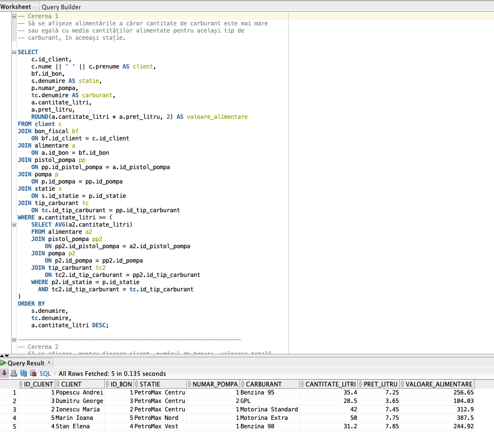

---

### Cererea 2

Să se afișeze, pentru fiecare client, numărul de bonuri, valoarea totală a
alimentărilor, valoarea totală a produselor cumpărate și valoarea totală
generală. Pentru clienții fără anumite valori se va afișa 0. Statusul clientului
se va determina folosind `DECODE`.

**Elemente utilizate:**

* subcereri nesincronizate în clauza `FROM`;
* `NVL`;
* `DECODE`;
* funcții grup;
* ordonare.

```sql
SELECT
    c.id_client,
    INITCAP(c.nume || ' ' || c.prenume) AS client,
    COUNT(bf.id_bon) AS nr_bonuri,
    NVL(SUM(va.valoare_alimentare), 0) AS total_carburant,
    NVL(SUM(vp.valoare_produse), 0) AS total_produse,
    NVL(SUM(va.valoare_alimentare), 0)
        + NVL(SUM(vp.valoare_produse), 0) AS total_general,
    DECODE(
        COUNT(bf.id_bon),
        0, 'fara bonuri',
        DECODE(
            SIGN(NVL(SUM(va.valoare_alimentare), 0)),
            0, 'doar produse magazin',
            'are alimentari'
        )
    ) AS status_client
FROM client c
LEFT JOIN bon_fiscal bf
    ON bf.id_client = c.id_client
LEFT JOIN (
    SELECT
        id_bon,
        SUM(cantitate_litri * pret_litru) AS valoare_alimentare
    FROM alimentare
    GROUP BY id_bon
) va
    ON va.id_bon = bf.id_bon
LEFT JOIN (
    SELECT
        id_bon,
        SUM(cantitate * pret_unitar) AS valoare_produse
    FROM articol_bon
    GROUP BY id_bon
) vp
    ON vp.id_bon = bf.id_bon
GROUP BY
    c.id_client,
    c.nume,
    c.prenume
ORDER BY
    total_general DESC,
    client ASC;
```

### Rezultat

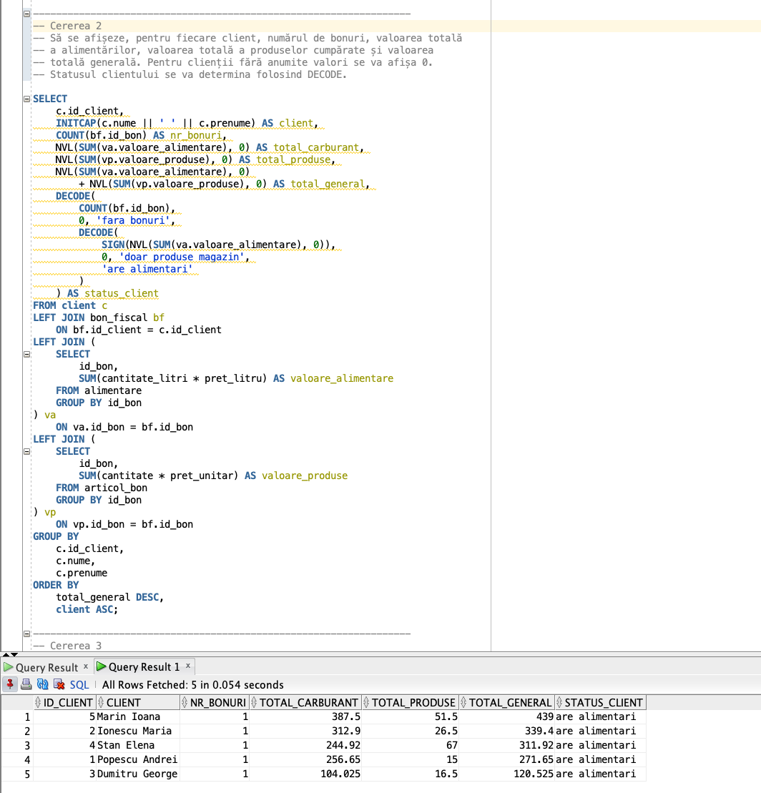

---

### Cererea 3

Să se afișeze categoriile de produse din magazin pentru care valoarea totală a
vânzărilor este mai mare sau egală cu media valorilor totale ale vânzărilor pe
categorii.

**Elemente utilizate:**

* grupări de date;
* funcții grup: `COUNT`, `SUM`, `AVG`;
* filtrare la nivel de grupuri cu `HAVING`;
* subcerere nesincronizată în clauza `HAVING`;
* ordonare.

```sql
SELECT
    NVL(pm.categorie, 'necunoscuta') AS categorie_produs,
    COUNT(DISTINCT pm.id_produs_magazin) AS nr_produse_vandute,
    COUNT(DISTINCT ab.id_bon) AS nr_bonuri,
    SUM(ab.cantitate) AS cantitate_totala,
    ROUND(SUM(ab.cantitate * ab.pret_unitar), 2) AS valoare_totala,
    ROUND(AVG(ab.pret_unitar), 2) AS pret_mediu_vanzare
FROM produs_magazin pm
JOIN articol_bon ab
    ON ab.id_produs_magazin = pm.id_produs_magazin
GROUP BY
    NVL(pm.categorie, 'necunoscuta')
HAVING SUM(ab.cantitate * ab.pret_unitar) >= (
    SELECT AVG(valoare_categorie)
    FROM (
        SELECT
            SUM(ab2.cantitate * ab2.pret_unitar) AS valoare_categorie
        FROM produs_magazin pm2
        JOIN articol_bon ab2
            ON ab2.id_produs_magazin = pm2.id_produs_magazin
        GROUP BY
            NVL(pm2.categorie, 'necunoscuta')
    )
)
ORDER BY
    valoare_totala DESC;
```

### Rezultat

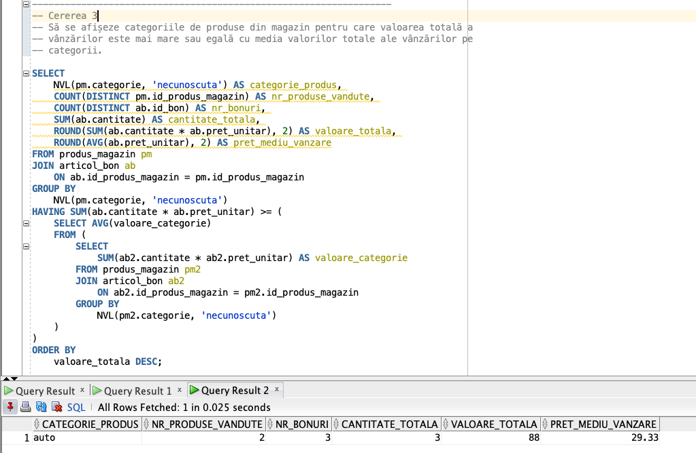

---

### Cererea 4

Să se afișeze bonurile fiscale împreună cu numele clientului formatat, informații
despre data emiterii bonului și tipul bonului: bon doar cu alimentare, bon doar
cu produse din magazin sau bon mixt.

**Elemente utilizate:**

* funcții pe șiruri de caractere: `UPPER`, `INITCAP`, `SUBSTR`;
* funcții pe date calendaristice: `TRUNC`, `TO_CHAR`, `EXTRACT`, `MONTHS_BETWEEN`;
* expresie `CASE`;
* subcereri sincronizate cu `EXISTS`;
* ordonare.

```sql
SELECT
    bf.id_bon,
    UPPER(c.nume) || ' ' || INITCAP(c.prenume) AS client_formatat,
    SUBSTR(NVL(c.telefon, 'fara telefon'), 1, 10) AS telefon_scurt,
    bf.metoda_plata,
    TRUNC(bf.data_bon) AS data_calendaristica,
    TO_CHAR(bf.data_bon, 'FMDay', 'NLS_DATE_LANGUAGE=ROMANIAN') AS zi_saptamana,
    EXTRACT(MONTH FROM bf.data_bon) AS luna_bon,
    ROUND(MONTHS_BETWEEN(SYSDATE, bf.data_bon), 2) AS vechime_luni,
    CASE
        WHEN EXISTS (
            SELECT 1
            FROM alimentare a
            WHERE a.id_bon = bf.id_bon
        )
        AND EXISTS (
            SELECT 1
            FROM articol_bon ab
            WHERE ab.id_bon = bf.id_bon
        )
            THEN 'bon mixt: carburant si produse'
        WHEN EXISTS (
            SELECT 1
            FROM alimentare a
            WHERE a.id_bon = bf.id_bon
        )
            THEN 'bon doar cu alimentare'
        WHEN EXISTS (
            SELECT 1
            FROM articol_bon ab
            WHERE ab.id_bon = bf.id_bon
        )
            THEN 'bon doar cu produse'
        ELSE 'bon fara detalii'
    END AS tip_bon
FROM bon_fiscal bf
JOIN client c
    ON c.id_client = bf.id_client
ORDER BY
    TRUNC(bf.data_bon) DESC,
    UPPER(c.nume),
    INITCAP(c.prenume);
```

### Rezultat

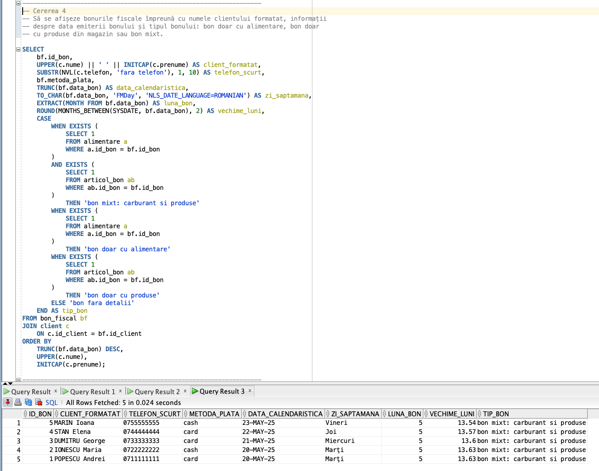

---

### Cererea 5

Să se afișeze, pentru fiecare stație și fiecare tip de carburant care are
activitate, cantitatea totală livrată, cantitatea totală vândută, cantitatea
estimată rămasă și profitul brut estimativ.

**Elemente utilizate:**

* clauza `WITH`;
* două blocuri de cerere: `vanzari_carburant` și `livrari_carburant`;
* join-uri;
* `NVL`;
* expresie `CASE`;
* funcții grup;
* ordonare.

```sql
WITH vanzari_carburant AS (
    SELECT
        p.id_statie,
        pp.id_tip_carburant,
        SUM(a.cantitate_litri) AS litri_vanduti,
        SUM(a.cantitate_litri * a.pret_litru) AS valoare_vanzari
    FROM alimentare a
    JOIN pistol_pompa pp
        ON pp.id_pistol_pompa = a.id_pistol_pompa
    JOIN pompa p
        ON p.id_pompa = pp.id_pompa
    GROUP BY
        p.id_statie,
        pp.id_tip_carburant
),
livrari_carburant AS (
    SELECT
        id_statie,
        id_tip_carburant,
        SUM(cantitate_litri) AS litri_livrati,
        SUM(cantitate_litri * pret_litru) AS cost_livrari
    FROM livrare_carburant
    GROUP BY
        id_statie,
        id_tip_carburant
)
SELECT
    s.denumire AS statie,
    tc.denumire AS carburant,
    NVL(lc.litri_livrati, 0) AS litri_livrati,
    NVL(vc.litri_vanduti, 0) AS litri_vanduti,
    NVL(lc.litri_livrati, 0) - NVL(vc.litri_vanduti, 0) AS litri_ramasi_estimati,
    ROUND(NVL(vc.valoare_vanzari, 0) - NVL(lc.cost_livrari, 0), 2) AS profit_brut_estimativ,
    CASE
        WHEN NVL(lc.litri_livrati, 0) = 0
            THEN 'nu exista livrari'
        WHEN NVL(lc.litri_livrati, 0) - NVL(vc.litri_vanduti, 0) < 0
            THEN 'vanzari peste livrari'
        WHEN NVL(lc.litri_livrati, 0) - NVL(vc.litri_vanduti, 0) <= 1000
            THEN 'stoc estimat redus'
        ELSE 'stoc estimat suficient'
    END AS situatie_carburant
FROM statie s
CROSS JOIN tip_carburant tc
LEFT JOIN vanzari_carburant vc
    ON vc.id_statie = s.id_statie
   AND vc.id_tip_carburant = tc.id_tip_carburant
LEFT JOIN livrari_carburant lc
    ON lc.id_statie = s.id_statie
   AND lc.id_tip_carburant = tc.id_tip_carburant
WHERE NVL(lc.litri_livrati, 0) > 0
   OR NVL(vc.litri_vanduti, 0) > 0
ORDER BY
    s.denumire,
    tc.denumire;
```

### Rezultat

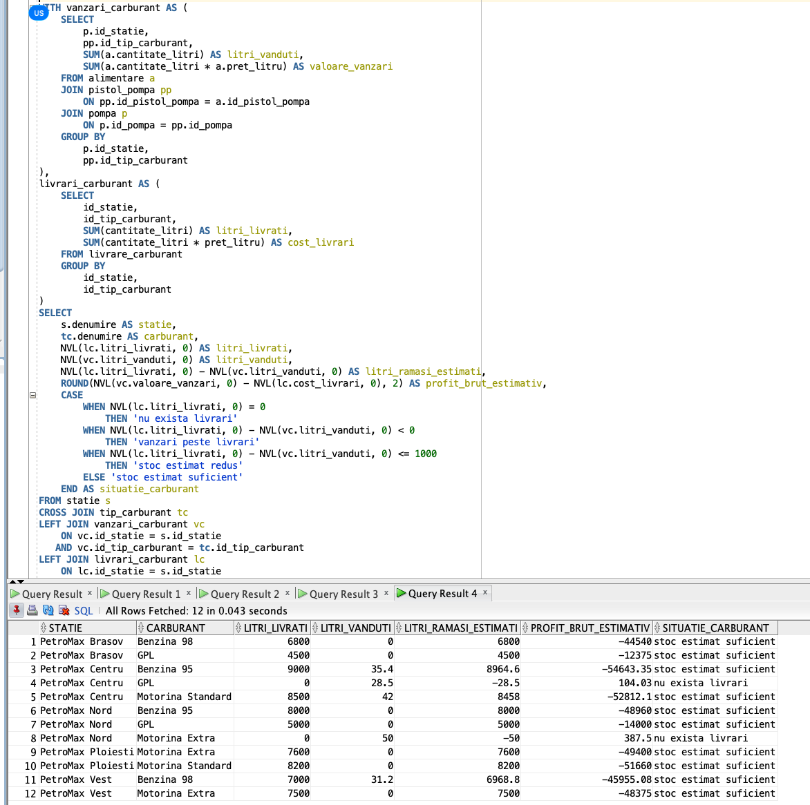

## 13. Implementarea a 3 operații de actualizare și de suprimare a datelor utilizând subcereri

### Operația 1 — Actualizarea prețului curent al carburanților

Să se actualizeze prețul curent al fiecărui tip de carburant care a fost
livrat cel puțin o dată. Noul preț se calculează ca media prețurilor de 
livrare pentru acel carburant, la care se adaugă un adaos comercial de 
15%.

```sql
UPDATE tip_carburant tc
SET tc.pret_litru = (
    SELECT ROUND(AVG(lc.pret_litru) * 1.15, 2)
    FROM livrare_carburant lc
    WHERE lc.id_tip_carburant = tc.id_tip_carburant
)
WHERE tc.id_tip_carburant IN (
    SELECT DISTINCT lc2.id_tip_carburant
    FROM livrare_carburant lc2
);
```

### Rezultat

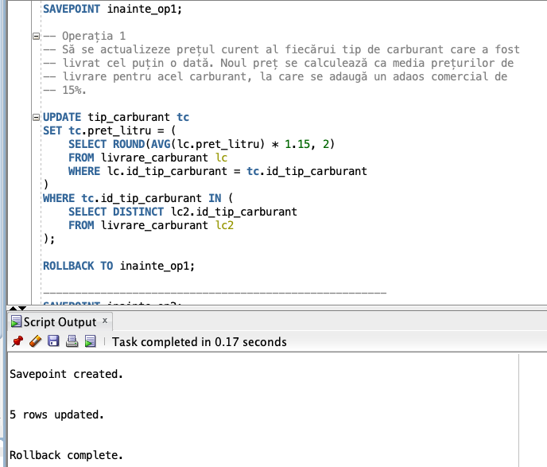

---

### Operația 2 — Trecerea în revizie a pompelor foarte utilizate

Să se treacă în starea `revizie` pompele funcționale pentru care cantitatea totală de carburant vândută este mai mare decât media cantităților totale vândute pe pompă.

```sql
UPDATE pompa p
SET p.stare = 'revizie'
WHERE p.stare = 'functionala'
  AND p.id_pompa IN (
    SELECT pp.id_pompa
    FROM pistol_pompa pp
    JOIN alimentare a
        ON a.id_pistol_pompa = pp.id_pistol_pompa
    GROUP BY pp.id_pompa
    HAVING SUM(a.cantitate_litri) > (
        SELECT AVG(total_litri_pompa)
        FROM (
            SELECT
                pp2.id_pompa,
                SUM(a2.cantitate_litri) AS total_litri_pompa
            FROM pistol_pompa pp2
            JOIN alimentare a2
                ON a2.id_pistol_pompa = pp2.id_pistol_pompa
            GROUP BY pp2.id_pompa
        )
    )
);
```

### Rezultat

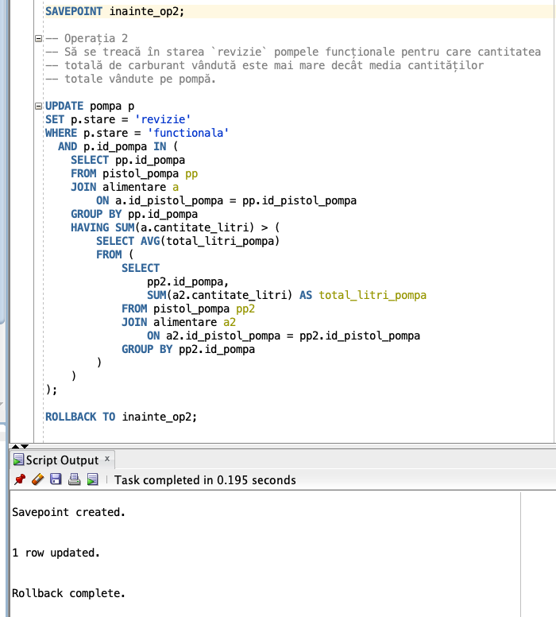

---

### Operația 3 — Ștergerea programărilor vechi ale angajaților cu salariu sub medie

Să se șteargă programările mai vechi decât cea mai recentă programare 
existentă în tabel, dar numai pentru angajații care au salariul mai mic decât salariul mediu al tuturor angajaților.

```sql
DELETE FROM programare_tura pt
WHERE pt.data_programare < (
    SELECT MAX(pt2.data_programare)
    FROM programare_tura pt2
)
AND pt.id_angajat IN (
    SELECT a.id_angajat
    FROM angajat a
    WHERE a.salariu < (
        SELECT AVG(a2.salariu)
        FROM angajat a2
    )
);
```

### Rezultat

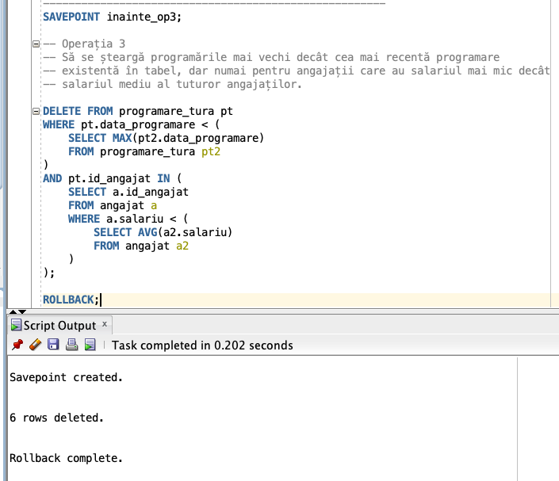

## 14. Crearea unei vizualizări complexe

Să se creeze o vizualizare care afișează alimentările efectuate de clienți, 
împreună cu bonul fiscal, stația, pompa, pistolul folosit, tipul de carburant, 
cantitatea alimentată, prețul pe litru și valoarea totală a alimentării.

Vizualizarea este complexă deoarece folosește mai multe tabele, 
operații de `JOIN`, coloane calculate și o expresie `CASE`.

```sql
CREATE OR REPLACE VIEW v_alimentari_detaliate AS
SELECT
    a.id_alimentare,
    a.id_bon,
    bf.id_client,
    c.nume || ' ' || c.prenume AS client,
    bf.data_bon,
    bf.metoda_plata,
    s.id_statie,
    s.denumire AS statie,
    p.id_pompa,
    p.numar_pompa,
    pp.id_pistol_pompa,
    pp.numar_pistol,
    tc.id_tip_carburant,
    tc.denumire AS carburant,
    a.cantitate_litri,
    a.pret_litru,
    ROUND(a.cantitate_litri * a.pret_litru, 2) AS valoare_alimentare,
    CASE
        WHEN a.cantitate_litri < 20 THEN 'alimentare mica'
        WHEN a.cantitate_litri BETWEEN 20 AND 40 THEN 'alimentare medie'
        ELSE 'alimentare mare'
    END AS categorie_alimentare
FROM alimentare a
JOIN bon_fiscal bf
    ON bf.id_bon = a.id_bon
JOIN client c
    ON c.id_client = bf.id_client
JOIN pistol_pompa pp
    ON pp.id_pistol_pompa = a.id_pistol_pompa
JOIN pompa p
    ON p.id_pompa = pp.id_pompa
JOIN statie s
    ON s.id_statie = p.id_statie
JOIN tip_carburant tc
    ON tc.id_tip_carburant = pp.id_tip_carburant;
```

### Verificarea vizualizării

```sql
SELECT *
FROM v_alimentari_detaliate;
```

## Operație LMD permisă

Această operație este permisă deoarece modifică doar o coloană reală din tabela `ALIMENTARE`, 
iar fiecare rând din vizualizare corespunde unei singure alimentări.

```sql
UPDATE v_alimentari_detaliate
SET cantitate_litri = cantitate_litri + 1
WHERE id_alimentare = 1;
```

Verificare:

```sql
SELECT
    id_alimentare,
    cantitate_litri,
    pret_litru,
    valoare_alimentare
FROM v_alimentari_detaliate
WHERE id_alimentare = 1;
```

## Operație LMD nepermisă

Această operație nu este permisă deoarece `valoare_alimentare` nu este o 
coloană reală dintr-o tabelă, ci o coloană calculată în vizualizare prin expresia:

```sql
ROUND(a.cantitate_litri * a.pret_litru, 2)
```

Operația:

```sql
UPDATE v_alimentari_detaliate
SET valoare_alimentare = 300
WHERE id_alimentare = 1;
```

Rezultatul așteptat este eroare, deoarece nu se poate modifica direct o coloană calculată dintr-o vizualizare.

### Rezultat

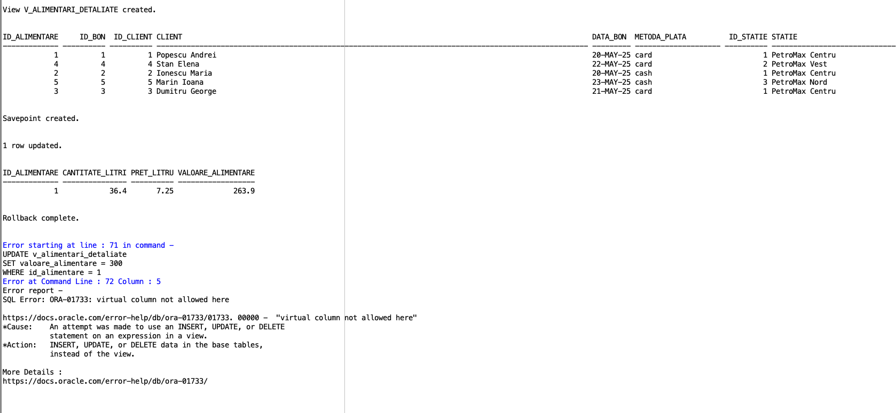
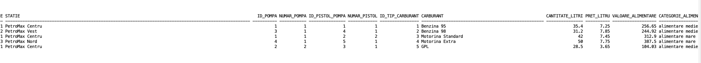


## 15. Cereri SQL cu outer-join, division și analiză top-n

### Cererea 1 — Outer-join pe minimum 4 tabele

Să se afișeze toate stațiile și angajații acestora, împreună cu programarea în tură și casa de marcat, 
dacă angajatul este casier. Se vor afișa și stațiile fără angajați, angajații fără programare și 
angajații care nu sunt casieri.

**Elemente utilizate:**

* operația `LEFT JOIN`;
* outer-join pe minimum 4 tabele;
* tabele folosite: `STATIE`, `ANGAJAT`, `PROGRAMARE_TURA`, `TURA`, `CASIER`.

```sql
SELECT
    s.id_statie,
    s.denumire AS statie,
    a.id_angajat,
    a.nume || ' ' || a.prenume AS angajat,
    NVL(t.denumire, 'fara tura') AS tura,
    pt.data_programare,
    NVL(TO_CHAR(ca.numar_casa), 'nu este casier') AS casa_de_marcat
FROM statie s
LEFT JOIN angajat a
    ON a.id_statie = s.id_statie
LEFT JOIN programare_tura pt
    ON pt.id_angajat = a.id_angajat
LEFT JOIN tura t
    ON t.id_tura = pt.id_tura
LEFT JOIN casier ca
    ON ca.id_angajat = a.id_angajat
ORDER BY
    s.denumire,
    a.nume,
    a.prenume;
```

### Rezultat

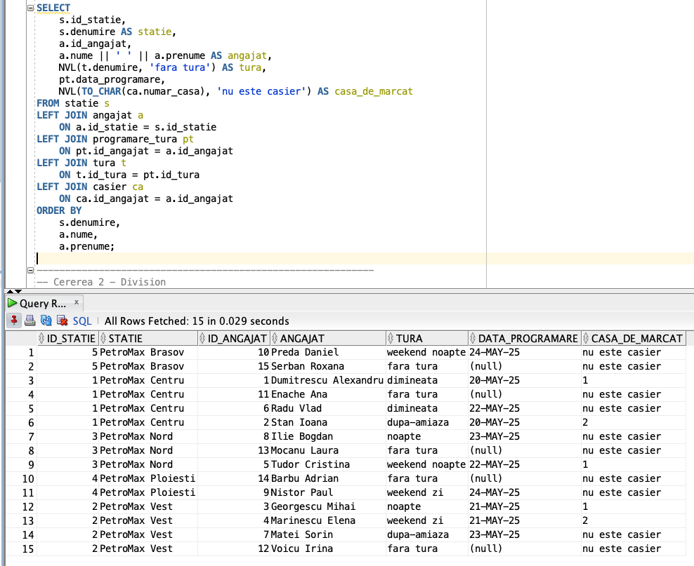

---

### Cererea 2 — Division

Să se afișeze tipurile de carburant care au fost livrate de toți furnizorii care au efectuat cel puțin o livrare de carburant.

**Elemente utilizate:**

* operația division;
* implementare prin dublu `NOT EXISTS`;
* tabele folosite: `TIP_CARBURANT`, `LIVRARE_CARBURANT`.

```sql
SELECT
    tc.id_tip_carburant,
    tc.denumire AS carburant
FROM tip_carburant tc
WHERE NOT EXISTS (
    SELECT 1
    FROM (
        SELECT DISTINCT id_furnizor
        FROM livrare_carburant
    ) f_carburant
    WHERE NOT EXISTS (
        SELECT 1
        FROM livrare_carburant lc
        WHERE lc.id_tip_carburant = tc.id_tip_carburant
          AND lc.id_furnizor = f_carburant.id_furnizor
    )
)
ORDER BY
    tc.denumire;
```

### Rezultat

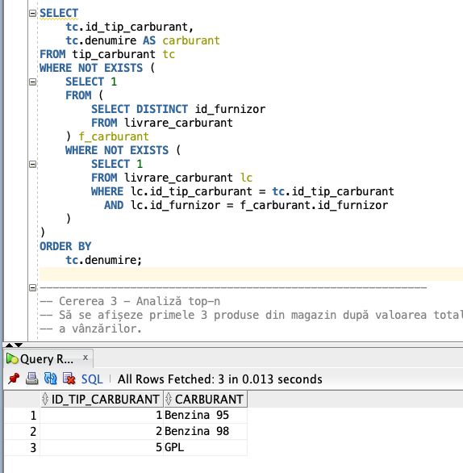

---

### Cererea 3 — Analiză top-n

Să se afișeze primele 3 produse din magazin după valoarea totală a vânzărilor.

**Elemente utilizate:**

* analiză top-n;
* subcerere ordonată;
* filtrare cu `ROWNUM`;
* funcții grup: `SUM`;
* tabele folosite: `PRODUS_MAGAZIN`, `ARTICOL_BON`.

```sql
SELECT *
FROM (
    SELECT
        pm.id_produs_magazin,
        pm.denumire AS produs,
        pm.categorie,
        SUM(ab.cantitate) AS cantitate_totala_vanduta,
        ROUND(SUM(ab.cantitate * ab.pret_unitar), 2) AS valoare_totala_vanzari
    FROM produs_magazin pm
    JOIN articol_bon ab
        ON ab.id_produs_magazin = pm.id_produs_magazin
    GROUP BY
        pm.id_produs_magazin,
        pm.denumire,
        pm.categorie
    ORDER BY
        valoare_totala_vanzari DESC
)
WHERE ROWNUM <= 3;
```

### Rezultat

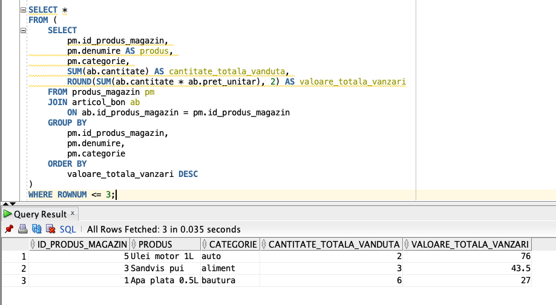